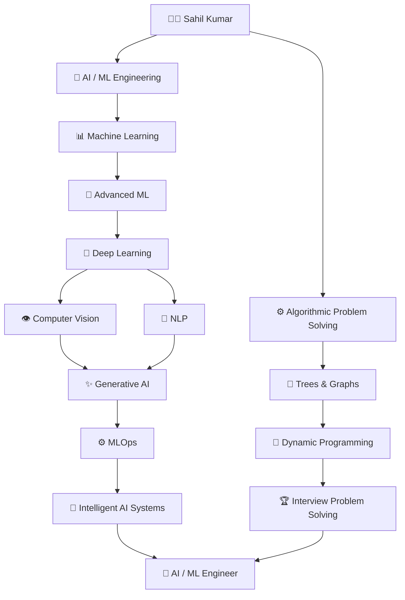

<!-- ====================================================== -->

<!--                    PREMIUM HERO                        -->

<!-- ====================================================== -->

  

  

---

<!-- ====================================================== -->

<!--                       ABOUT                             -->

<!-- ====================================================== -->

##  About Me

 

### `AI/ML` is where I build. `DSA` is how I sharpen my thinking.

I'm a **B.Tech CSE (Artificial Intelligence)** student building my foundation in Machine Learning while strengthening my algorithmic problem-solving through DSA in C++.

I enjoy understanding **why algorithms work**, experimenting with models, comparing approaches, and turning concepts into practical notebooks and projects.

My long-term goal is to move beyond simply training models and learn how to build **reliable, scalable and intelligent AI systems**.

---

<!-- ====================================================== -->

<!--                 CURRENTLY WORKING ON                    -->

<!-- ====================================================== -->

## 🎯 What I'm Focused On

<table width="100%">

<tr>

<td width="33%" align="center">

### 🤖 AI / ML

Machine Learning

Ensemble Methods

Model Evaluation

ML Experiments

</td>

<td width="33%" align="center">

### ⚙️ DSA

C++

Graphs

Problem Solving

Algorithmic Thinking

</td>

<td width="33%" align="center">

### 🚀 Building

Jupyter Notebooks

ML Projects

GitHub Portfolio

Learning in Public

</td>

</tr>

</table>

---

<!-- ====================================================== -->

<!--                   TWO PILLARS                           -->

<!-- ====================================================== -->

## 🧭 My Engineering Journey

---

<!-- ====================================================== -->

<!--                   AI ML JOURNEY                         -->

<!-- ====================================================== -->

## 🤖 AI/ML — My Primary Journey

> ### I don't want to only know *how to use a model*.
>
> I want to understand **why it works, when it fails, and how to improve it.**

 

<table width="100%">

<tr>

<td width="25%" valign="top">

### 📈 Regression

* ✅ Linear Regression
* ✅ Multiple Regression
* ✅ Polynomial Regression
* ✅ Ridge & Lasso
* ✅ Elastic Net
* ✅ Gradient Descent

</td>

<td width="25%" valign="top">

### 🎯 Classification

* ✅ Logistic Regression
* ✅ Decision Trees
* ✅ SVM
* ✅ Naive Bayes
* ✅ KNN
* ✅ Multiclass Models

</td>

<td width="25%" valign="top">

### 📊 Evaluation

* ✅ Accuracy
* ✅ Precision
* ✅ Recall
* ✅ F1 Score
* ✅ ROC-AUC
* ✅ Cross Validation

</td>

<td width="25%" valign="top">

### 🧩 Ensembles

* ✅ Voting
* ✅ Bagging
* 🔄 Random Forest
* 🔜 Boosting
* 🔜 XGBoost
* 🔜 Stacking

</td>

</tr>

</table>

`✅ Learned & Practiced`    `🔄 Currently Exploring`    `🔜 Coming Next`

---

<!-- ====================================================== -->

<!--                   DSA JOURNEY                           -->

<!-- ====================================================== -->

## ⚙️ DSA — Sharpening the Problem-Solving Engine

While AI/ML is my primary career direction, I practice **Data Structures & Algorithms in C++** to develop stronger problem-solving, optimization and computational thinking.

  

  

`Arrays` • `Linked Lists` • `Stacks` • `Queues` • `Trees` • `Graphs` • `Heaps` • `Dynamic Programming`

  

> **The goal isn't memorizing solutions — it's learning how to think through problems.**

---

<!-- ====================================================== -->

<!--                    TECH STACK                           -->

<!-- ====================================================== -->

## ⚡ Technical Arsenal

### 💻 Languages

  

### 📊 Data Science & Machine Learning

  

### 🛠️ Development

 

### 🔮 Exploring Next

  

`PyTorch` • `Deep Learning` • `Computer Vision` • `NLP`

`Transformers` • `Generative AI` • `MLOps` • `Agentic AI`

  

These represent the direction of my learning roadmap, not technologies I claim to have mastered yet.

---

<!-- ====================================================== -->

<!--                     PROJECTS                            -->

<!-- ====================================================== -->

## 🚀 Featured Projects

<table width="100%">

<tr>

<td width="50%" valign="top">

### 🏠 House Price Prediction

An end-to-end Machine Learning regression project focused on predicting house prices from real-world features.

**Highlights**

* Exploratory Data Analysis
* Data Preprocessing
* Feature Engineering
* Regression Algorithms
* Model Comparison
* Performance Evaluation

**Built With**

`Python` `NumPy` `Pandas`

`Scikit-learn` `Matplotlib`

</td>

<td width="50%" valign="top">

### 🩺 Classification ML Project

A classification project focused on building and comparing Machine Learning models using multiple evaluation metrics.

**Highlights**

* Feature Scaling
* Classification Algorithms
* Cross Validation
* Precision & Recall
* F1 Score
* ROC-AUC Analysis

**Built With**

`Python` `Pandas` `Scikit-learn`

`Matplotlib` `Seaborn`

</td>

</tr>

</table>

 

### 🔨 Building Next

---

<!-- ====================================================== -->

<!--                    ROADMAP                              -->

<!-- ====================================================== -->

## 🗺️ The Road Ahead

I'm following a structured learning journey designed to progressively move from **Machine Learning fundamentals** toward advanced AI engineering.

 

### `Machine Learning`

⬇️

### `Advanced ML & Feature Engineering`

⬇️

### `Unsupervised Learning & Time Series`

⬇️

### `Deep Learning with PyTorch`

⬇️

### `Computer Vision & NLP`

⬇️

### `Generative AI & LLMs`

⬇️

### `MLOps & Deployment`

⬇️

### `Agentic AI Systems`

⬇️

### 🚀 **Production-Ready AI/ML Engineering**

 

<b>🗺️ Explore My 214-Day AI/ML Learning Path</b>

 

| Stage | Focus                                    |
| :---: | :--------------------------------------- |
|   01  | Regression & Regularization              |
|   02  | Classification                           |
|   03  | Trees, SVM & Ensembles                   |
|   04  | Boosting & Advanced Ensembles            |
|   05  | Preprocessing, Imbalanced Learning & XAI |
|   06  | Unsupervised Learning                    |
|   07  | Time Series                              |
|   08  | Neural Networks                          |
|   09  | CNNs                                     |
|   10  | Sequence Models                          |
|   11  | NLP & Transformers                       |
|   12  | Computer Vision                          |
|   13  | MLOps & APIs                             |
|   14  | Pipelines & CI/CD                        |
|   15  | Generative AI & LLMs                     |
|   16  | Agentic AI                               |
|   17  | Career Preparation                       |

---

<!-- ====================================================== -->

<!--                  GITHUB ANALYTICS                       -->

<!-- ====================================================== -->

## 📊 GitHub Analytics

  

---

<!-- ====================================================== -->

<!--                 CONTRIBUTION ACTIVITY                   -->

<!-- ====================================================== -->

## 📈 Contribution Activity

---

<!-- ====================================================== -->

<!--                       CONNECT                           -->

<!-- ====================================================== -->

## 🤝 Let's Connect

  

🤖 **AI/ML Engineering**   •   ⚙️ **DSA in C++**   •   🔬 **Experiments**   •   🚀 **Projects**

  

 

### 💭 Engineering Mindset

> **"Understand deeply. Experiment continuously. Build consistently."**

 

### ⚡ My Mission

**Learn AI • Build AI • Engineer AI**

 

⭐ **Sahil Kumar — AI/ML Engineer in the Making**

