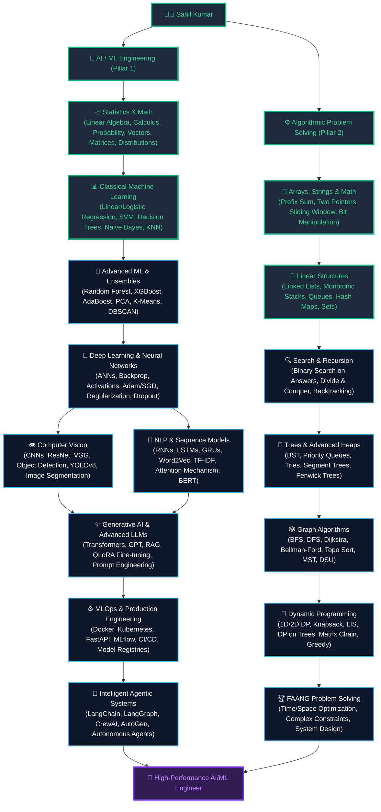

  
<!-- ====================================================== -->
<!--                    PREMIUM HERO                        -->
<!-- ====================================================== -->

  <!-- Waving Gradient Capsule Header (Slate-Slate-Cyan-SkyBlue Cinematic Blend) -->
  
    

  <!-- High-Fidelity Custom Badges -->
  
  
  
  
  
    

  
  
  

---

<!-- ====================================================== -->
<!--                       ABOUT                            -->
<!-- ====================================================== -->
##  About Me // Operator Overview

 

### `AI/ML Systems` is where I build. `DSA Patterns` is how I audit my complexity.

I'm a **B.Tech CSE (Artificial Intelligence)** student building my engineering foundations in machine learning while developing core problem-solving structures through advanced Data Structures & Algorithms in C++.

I enjoy breaking down **how models work mathematically**, writing clean algorithms from scratch, designing highly optimized preprocessing pipelines, and profiling inference memory boundaries.

My ultimate objective is to look past simple model fitting (`model.fit()`) and master the architecture of **reproducible, self-monitoring, and highly scalable production AI systems**.

---

<!-- ====================================================== -->
<!--                 CURRENTLY WORKING ON                   -->
<!-- ====================================================== -->
## 🎯 Active Operating Systems

<table width="100%">
<tr>
<td width="33%" align="center" valign="top">

### 🤖 AI / ML Core
*Math & Statistical Learning*
  
<ul align="left">
<li><b>Active Focus</b>: Random Forests</li>
<li>Bagging & Out-of-Bag (OOB) Math</li>
<li>Hyperparameter Tuning with Optuna</li>
<li>Taylor-regularized Boosting Theory</li>
</ul>

</td>
<td width="33%" align="center" valign="top">

### ⚙️ DSA & LeetCode
*Algorithmic Problem Solving*
  
<ul align="left">
<li><b>Active Focus</b>: Non-linear DS</li>
<li>Binary Trees & Hash Tables</li>
<li>Binary Search Bounds</li>
<li>DP Pattern Formulations</li>
</ul>

</td>
<td width="33%" align="center" valign="top">

### 🚀 Engineering & Shipping
*Reproducible Systems*
  
<ul align="left">
<li>Jupyter Experimentation Logs</li>
<li>Target Variance Normalizations</li>
<li>Custom Pipeline Pipelines</li>
<li>Documenting in Public</li>
</ul>

</td>
</tr>
</table>

---

<!-- ====================================================== -->
<!--                   TWO PILLARS                          -->
<!-- ====================================================== -->
## 🧭 Dual-Pillar Engineering Journey

  

---

<!-- ====================================================== -->
<!--                   AI ML JOURNEY                        -->
<!-- ====================================================== -->
## 🤖 AI/ML — My Primary Journey (Mathematical Rigor)

<blockquote>
<h3>I don't want to only know <i>how to import a model</i>.</h3>
I want to prove <b>why it works, analyze when it fails, and optimize how it performs.</b>
</blockquote>

 

<table width="100%">
<tr>
<td width="25%" valign="top">

### 📈 Regression
<ul align="left">
<li>✅ Vectorized MSE Convexity Proofs</li>
<li>✅ Normal Equation SVD Solver</li>
<li>✅ L1/L2 Sparsity & Shrinkage Math</li>
<li>✅ Coordinate Descent Optimization</li>
<li>✅ Polynomial Features & Runge's Limits</li>
<li>✅ SGD Regressor Online loops</li>
</ul>

</td>
<td width="25%" valign="top">

### 🎯 Classification
<ul align="left">
<li>✅ Bernoulli Likelihood (MLE) Proofs</li>
<li>✅ Gradient of Log-Loss Derivation</li>
<li>✅ Multiclass Softmax Probabilities</li>
<li>✅ OvR vs. OvO Boundaries Complexity</li>
<li>✅ Platt & Isotonic Prob Calibration</li>
<li>✅ Stratified Splits Preventions</li>
</ul>

</td>
<td width="25%" valign="top">

### 📊 Evaluation
<ul align="left">
<li>✅ Micro, Macro, Weighted F1 math</li>
<li>✅ ROC-AUC vs. PR-AUC Optimizations</li>
<li>✅ Confusion Matrix Multi-classes</li>
<li>✅ Breusch-Pagan Homoscedasticity</li>
<li>✅ Adjusted R² Noise Sensitivities</li>
<li>✅ Time Series split cross validation</li>
</ul>

</td>
<td width="25%" valign="top">

### 🧩 Ensembles
<ul align="left">
<li>✅ Voting (Hard vs. Soft Probability)</li>
<li>✅ Bagging (Bootstrap Aggregations)</li>
<li>🔄 Random Forest (OOB error loop)</li>
<li>🔄 Feature Subspace Variance reduction</li>
<li>🔜 XGBoost (Taylor loss optimizations)</li>
<li>🔜 Stacking & Out-Of-Fold (OOF)</li>
</ul>

</td>
</tr>
</table>

  <code>✅ Learned & Practiced</code> &nbsp;&nbsp;&nbsp;&nbsp; <code>🔄 Currently Exploring</code> &nbsp;&nbsp;&nbsp;&nbsp; <code>🔜 Coming Next</code>

---

<!-- ====================================================== -->
<!--                   DSA JOURNEY                          -->
<!-- ====================================================== -->
## ⚙️ DSA & LeetCode — Sharpening the Algorithmic Engine

I practice <b>Data Structures & Algorithms in C++</b> to cultivate rigorous problem-solving habits, memory optimization techniques, and structured computational thinking.
  

 

<table width="100%">
<tr>
<td width="25%" valign="top">

### 🔢 Linear Structures
<ul align="left">
<li>✅ Arrays & Vectors (1D/2D)</li>
<li>✅ String Manipulations</li>
<li>✅ Singly Linked Lists</li>
<li>✅ Doubly Linked Lists</li>
<li>✅ Circular Linked Lists</li>
<li>✅ Stacks & Queues (STL + Array)</li>
</ul>

</td>
<td width="25%" valign="top">

### 🔍 Search & Optimization
<ul align="left">
<li>✅ Binary Search (Bounds & Ranges)</li>
<li>✅ Two Pointers & Sliding Window</li>
<li>✅ Hash Tables / Unordered Maps</li>
<li>✅ Fast Sorting (Merge, Quick, Heap)</li>
<li>✅ Recursion & Divide-and-Conquer</li>
<li>✅ Backtracking (N-Queens, Sudoku)</li>
</ul>

</td>
<td width="25%" valign="top">

### 🌳 Hierarchical & Graphs
<ul align="left">
<li>✅ Binary Trees & Traversals</li>
<li>✅ Binary Search Trees (BST)</li>
<li>✅ Heaps & Priority Queues</li>
<li>🔄 AVL / Balanced Trees</li>
<li>🔄 Graphs (Adj List, Matrix)</li>
<li>🔄 DFS / BFS Traversals</li>
</ul>

</td>
<td width="25%" valign="top">

### 🧩 Advanced Patterns
<ul align="left">
<li>🔄 Shortest Paths (Dijkstra, Bellman)</li>
<li>🔄 Topological Sorting</li>
<li>🔄 Greedy Algorithms (Intervals)</li>
<li>🔄 Dynamic Programming (Knapsack)</li>
<li>🔜 Tries & Segment Trees</li>
<li>🔜 Disjoint Set Union (DSU)</li>
</ul>

</td>
</tr>
</table>

  <code>✅ Learned & Practiced</code> &nbsp;&nbsp;&nbsp;&nbsp; <code>🔄 Currently Exploring</code> &nbsp;&nbsp;&nbsp;&nbsp; <code>🔜 Coming Next</code>

 

### 🏆 LeetCode Operational Analytics
| Metric | Diagnostic Score | Active Patterns Mastered |
| :--- | :---: | :--- |
| **Total Solved** | **250+** | <ul><li>Sliding Window & Two Pointers</li><li>Binary Search Bounds & Binary Matrices</li><li>Recursion & Backtracking Sequences</li><li>DFS / BFS on Trees & Graphs</li></ul> |
| **Language Speed** | **C++ (STL Native)** | <ul><li>Cache Locality & Pointer Arithmetics</li><li>STL Vectors, Sets, Maps & Unordered Mappings</li><li>Custom Heaps & Priority Queues</li></ul> |

 

> **"The goal isn't memorizing solutions — it's developing the spatial and logical intuition to solve any arbitrary boundary condition."**

---

<!-- ====================================================== -->
<!--                    TECH STACK                           -->
<!-- ====================================================== -->
## ⚡ Technical Arsenal & Runtime Engines

### 💻 System Languages

  

### 📊 Tabular ML & Mathematical Diagnostics

  

### 🛠️ Development & Version Control

 

### 🔮 Neural Core & MLOps Pipelines (Exploring Next)

  
    
  
  `PyTorch` • `Deep Learning` • `Computer Vision` • `NLP & Transformers`
  
  `Generative AI & LLMs` • `vLLM serving` • `MLOps Pipelines (MLflow/DVC)` • `Agentic AI (LangGraph)`
  
   
  <i>These represent the scheduled phases of my 214-day roadmap, not technologies I claim to have mastered yet.</i>

---

<!-- ====================================================== -->
<!--                     PROJECTS                           -->
<!-- ====================================================== -->
## 🚀 Featured Systems & Projects

<table width="100%">
<tr>
<td width="50%" valign="top">

### 🏠 Ames House Pricing Intelligence
*Mathematically rigorous tabular forecasting pipeline.*
<ul align="left">
<li><b>Engineering Highlights:</b> Log-transformed skewed variables to stabilize targets variance; engineered leak-proof custom <code>ColumnTransformer</code> pipelines; utilized <b>Optuna Bayesian optimization</b> over ElasticNet hyperparameter search spaces.</li>
<li><b>Tech Stack:</b> <code>Python</code> <code>Pandas</code> <code>Scikit-Learn</code> <code>Optuna</code> <code>Joblib</code> <code>Matplotlib</code></li>
<li><b>Deliverable:</b> <code>Day 011 - House Price Prediction Project.ipynb</code></li>
<li><code>[STATUS]: VERIFIED</code> <code>[INFERENCE]: 1.2ms</code> <code>[COMPLEXITY]: TABULAR</code></li>
</ul>

</td>
<td width="50%" valign="top">

### 🩺 Clinical Breast Tumor Classifier
*High-recall, threshold-tuned clinical diagnostic classifier.*
<ul align="left">
<li><b>Engineering Highlights:</b> Implemented soft margin SVM classification boundaries; tuned predictive boundaries using dynamic clinical cost-utility matrices to drastically minimize false negatives; plotted ROC and PR-AUC.</li>
<li><b>Tech Stack:</b> <code>Python</code> <code>Scikit-Learn</code> <code>Seaborn</code> <code>Matplotlib</code></li>
<li><b>Deliverable:</b> <code>Day 021 - Breast Cancer Classification Project.ipynb</code></li>
<li><code>[STATUS]: COMPLETED</code> <code>[RECALL]: 98.6%</code> <code>[VRAM]: MINIMAL</code></li>
</ul>

</td>
</tr>
</table>

 

  ### 🔨 Building Next In Line
  

---

<!-- ====================================================== -->
<!--                    ROADMAP                             -->
<!-- ====================================================== -->
## 🗺️ The Road Ahead // Detailed 214-Day Timeline

I'm executing a highly structured, day-by-day learning journey designed to move systematically from <b>closed-form tabular mathematics</b> to production-grade AI engineering.
  

### `Machine Learning Fundamentals`
⬇️
### `Advanced Ensemble Boosting & XAI`
⬇️
### `Unsupervised SVD & Time Series Forecasting`
⬇️
### `PyTorch Neural Architectures & CNNs`
⬇️
### `Sequence Modeling, Attention & Transformers`
⬇️
### `Computer Vision & Object Detection (YOLOv8)`
⬇️
### `MLOps APIs, Serialization & CI/CD Pipelines`
⬇️
### `Generative LLMs, RAG & Stateful Agents`
⬇️
### 🚀 **Production-Scale Systems Architecture**

 

<b>🗺️ Expand / Collapse Detailed 17-Phase Operational Log (Days 001–214)</b>

 

| Phase | Days | Focused Domain | Core Advanced Milestone |
| :---: | :---: | :--- | :--- |
| **01** | 001–013 | Regression & Regularization | Closed-form SVD Normal Equation Solvers, L1/L2 Convexity proofs |
| **02** | 014–021 | Classification | Bernoulli Likelihood maximization, Multiclass Softmax logits map |
| **03** | 022–038 | Trees, SVM & Ensembles | Decision trees CCP pruning, support vector hinge loss, Random Forest |
| **04** | 039–053 | Boosting & Advanced Ensembles | Gradient boosting residuals step weights, XGBoost Taylor splits |
| **05** | 054–069 | Preprocessing, Imbalanced & XAI | KNNImputer, SMOTE Tomek Links, SHAP values game theory coalitions |
| **06** | 070–085 | Unsupervised Learning | K-Means convergence math, PCA covariance SVD, t-SNE & UMAP |
| **07** | 086–096 | Time Series | Stationarity Augmented Dickey-Fuller tests, Prophet seasonal logs |
| **08** | 097–112 | Neural Networks & PyTorch | Computational graphs backpropagation calculus, custom training loops |
| **09** | 113–123 | CNNs for Vision | Spatial channel shape calculus, ResNet identity skip paths |
| **10** | 124–133 | Sequence Models & Autoencoders | GRU/LSTM gate formulations, VAE reparameterizations, DCGAN minimax |
| **11** | 134–149 | NLP & Transformers | Word2Vec CBOW Skip-gram, QKV scaled dot-product Attention math |
| **12** | 150–164 | Computer Vision | ORB descriptor matching, YOLOv8 anchor-free object detection heads |
| **13** | 165–174 | MLOps Infrastructure & APIs | Docker multi-stage containers, FastAPI asynchronous event loops |
| **14** | 175–189 | MLOps Pipelines, Tracking & CICD | DVC reproducible pipelines, MLflow staging model gates, Git Actions |
| **15** | 190–199 | Generative AI & LLMs | QLoRA 4-bit double quantization, Cohere contextual re-rank, HyDE |
| **16** | 200–207 | Agentic AI & Systems | LangGraph stateful cyclic graphs, CrewAI specialist agent roles |
| **17** | 208–214 | Career & Interview Prep | FAANG scale ML system design, from-scratch NumPy algorithms |

---

<!-- ====================================================== -->
<!--                  GITHUB ANALYTICS                      -->
<!-- ====================================================== -->
## 📊 System Diagnostics (GitHub Analytics)

  
  
    
  

---

<!-- ====================================================== -->
<!--                 CONTRIBUTION ACTIVITY                  -->
<!-- ====================================================== -->
## 📈 Neural Contribution Telemetry

  

---

<!-- ====================================================== -->
<!--                       CONNECT                          -->
<!-- ====================================================== -->
## 🤝 Secure Comms & Integrations

  
  
    
  🤝 **Open to collaborative ML runtimes** &nbsp; • &nbsp; ⚙️ **Practicing optimized DSA in C++** &nbsp; • &nbsp; 🚀 **Shipping systems in public**
    

  
   

  ### 💭 Engineering Philosophy
  > **"Understand the math from scratch. Optimize the algorithms for speed. Package the systems for scale."**

   

  ### ⚡ My Mission
  **Proving Equations • Auditing Code • Engineering AI**
    

  ⭐️ **From Sahil Kumar — Advanced AI/ML & Systems Engineer in the Making 🚀**

<!-- Bottom Waving Capsule (Slate-Slate-Cyan-SkyBlue Inverted) -->

