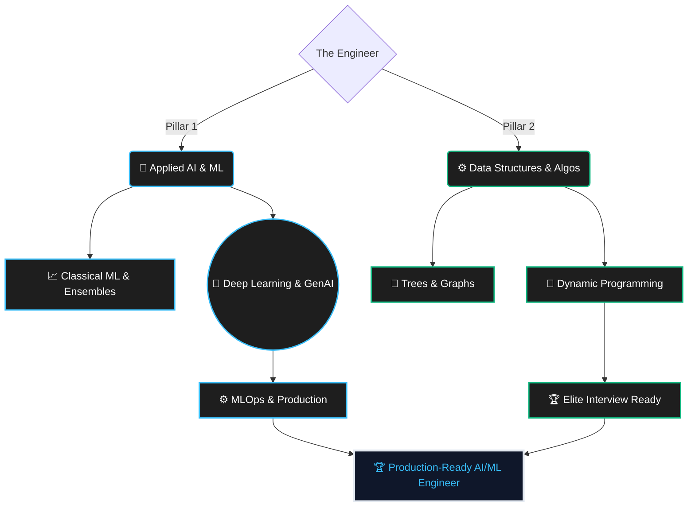

<div align="center">

# 👋 Sahil Kumar 
### *AI/ML Engineer in the Making & Algorithmic Problem Solver*

<br/>


<br/>


</div>

---

> [!IMPORTANT]
> **Who am I?**
> I am an aspiring AI/ML Engineer currently pursuing my B.Tech in CSE (Artificial Intelligence). I don't just consume tutorials; I build systems, derive mathematics, and grind algorithmic logic. This profile is the central hub of my daily executions.

---

## 🧠 Core Identity & Execution

```python
import torch
import torch.nn as nn

class Sahil(nn.Module):
    def __init__(self):
        super().__init__()
        self.role = "AI/ML Engineer"
        self.current_milestones = {
            "AI_ML": "Executing 214-Day Advanced Curriculum (Phase 3)",
            "DSA": "Mastering 180-Day Graph-First DSA in C++ (Phase 0)"
        }
        
        self.stack = nn.Sequential(
            MathematicalFoundations(core=["Calculus", "Linear Algebra"]),
            MachineLearning(frameworks=["Scikit-Learn", "XGBoost"]),
            DeepLearning(frameworks=["PyTorch"]),
            AlgorithmOptimization(language="C++")
        )

    def forward(self, consistency):
        if consistency == "Daily":
            return "Production-Grade Engineering Mastery"
        raise ValueError("Consistency must be Daily.")

# Initialize developer
me = Sahil()
print(me.forward(consistency="Daily"))
```

---

## 🗺️ The Dual Architecture of Mastery



---

## 📊 Live Progress Tracker

### 🤖 Pillar 1: AI/ML Engineering (214 Days)
| Phase | Title / Scope | Status | Mastery Progress |
| :---: | :--- | :---: | :--- |
| **01** | Linear Regression & Regularization | ✅ | 🟩🟩🟩🟩🟩🟩🟩🟩🟩🟩 `100%` |
| **02** | Logistic Regression & Classification | ✅ | 🟩🟩🟩🟩🟩🟩🟩🟩🟩🟩 `100%` |
| **03** | Tree Models, SVM & Base Ensembles | ✅ | 🟩🟩🟩🟩🟩🟩🟩🟩🟩🟩 `100%` |
| **04** | Boosting & Advanced Ensembles | 🔜 | ⬜⬜⬜⬜⬜⬜⬜⬜⬜⬜ `0%` |
| **05-07** | Preprocessing, XAI & Time Series | 🔜 | ⬜⬜⬜⬜⬜⬜⬜⬜⬜⬜ `0%` |
| **08-12** | Deep Learning, NLP & Vision | 🔜 | ⬜⬜⬜⬜⬜⬜⬜⬜⬜⬜ `0%` |
| **13-17** | MLOps, GenAI & Career Prep | 🔜 | ⬜⬜⬜⬜⬜⬜⬜⬜⬜⬜ `0%` |

### ⚙️ Pillar 2: Data Structures & Algorithms (180 Days)
| Phase | Title / Scope | Status | Mastery Progress |
| :---: | :--- | :---: | :--- |
| **00** | Graph Algorithms (BFS, DFS, Topo) | 🔄 | 🟩🟩🟩⬜⬜⬜⬜⬜⬜⬜ `30%` |
| **01** | Heaps & Advanced BST | 🔜 | ⬜⬜⬜⬜⬜⬜⬜⬜⬜⬜ `0%` |
| **02** | Greedy & Backtracking | 🔜 | ⬜⬜⬜⬜⬜⬜⬜⬜⬜⬜ `0%` |
| **03** | Dynamic Programming (1D, 2D) | 🔜 | ⬜⬜⬜⬜⬜⬜⬜⬜⬜⬜ `0%` |
| **04-09** | Advanced Tries, Math & Interviews | 🔜 | ⬜⬜⬜⬜⬜⬜⬜⬜⬜⬜ `0%` |

> [!TIP]
> **Check out the detailed syllabus and daily logs in my pinned repositories.**

---

## ⚡ Technical Arsenal

<div align="center">
  <br/>
  
</div>

<br/>

<div align="center">

| 🧠 Core AI/ML | ⚔️ Logic & Core | 🌐 Data & MLOps |
| :--- | :--- | :--- |
| `PyTorch` & `Scikit-Learn` | `C++` (DSA Language) | `Docker` & `FastAPI` |
| `TensorFlow` & `XGBoost` | `Python` (Scripting) | `NumPy` & `Pandas` |
| `HuggingFace` & `OpenCV` | `Git` & `Linux` | `Matplotlib` & `Seaborn` |

</div>

---

## 🚀 Featured Architectures & Projects

<details>
<summary><b>1️⃣ AI-ML-Blueprint (The Master Repository)</b></summary>
<br/>
My 214-day chronological journey repository containing daily Jupyter Notebooks, mathematical proofs ($LaTeX$), and custom PyTorch implementations. This is where the core engineering happens. <br/>
🔗 <a href="https://github.com/Sahil-K-Y/AI-ML-Blueprint">View Repository</a>
</details>

<details>
<summary><b>2️⃣ Advanced Regression Pipeline: House Price Prediction</b></summary>
<br/>
An end-to-end regression engine addressing multicollinearity (VIF), missing data imputation, and Elastic Net regularization. Cross-validated for maximum generalization.
</details>

<details>
<summary><b>3️⃣ Critical Diagnostic Classifier: Breast Cancer</b></summary>
<br/>
A classification pipeline prioritizing Recall over accuracy. Implements Stratified splits, SVM kernels, and ROC-AUC analysis to minimize fatal false negatives.
</details>

---

## 📊 GitHub Analytics

<div align="center">
  
  <br/>
  <br/>
  
</div>

---

<div align="center">

### *"I don't just learn algorithms; I engineer solutions."*

<a href="https://github.com/Sahil-K-Y">

</a>

</div>
